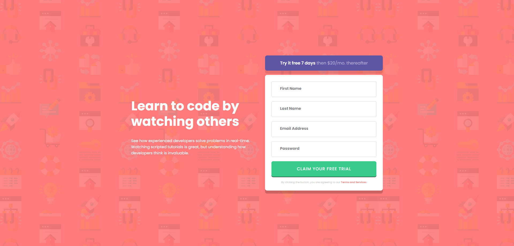

# Frontend Mentor - Intro component with sign up form

A responsive form challenge completed as part of the Frontend Mentor challenges. This form is built using HTML, CSS, and JavaScript and is designed to provide error messages when fields are filled out incorrectly. The responsive design ensures a consistent user experience across various devices.

## Features

- Responsive design to ensure compatibility with different screen sizes.
- Form validation that displays error messages for incorrectly filled out fields.
- Intuitive user experience with real-time error feedback.

## Technologies Used 🛠️

-  HTML5: Markup language for structuring the web page.
-  CSS3: Styling language for design and presentation.
-  JavaScript: Programming language for interactivity and form validation.

## Usage Instructions

1. Clone this repository
2. Navigate to the project directory
3. Open the `index.html` file in your web browser to view the responsive form.
4. Fill out the form fields and observe how error messages are displayed for incorrect entries.

## Form Validation

- The form includes JavaScript-based validation that checks each input field for correct entries.
- Error messages will be displayed in real-time when a field is filled out incorrectly.

## Customization

Feel free to customize and enhance the responsive form challenge according to your preferences:

- Modify the form fields and their validation criteria to match your requirements.
- Adjust the styling and layout to better align with your branding or design preferences.
- Implement additional features such as success messages upon correct form submission.

## Contributions

Contributions are welcome! If you have ideas for improvements or want to contribute in any way, please submit a pull request.

## Author ✒️

- **Carmenyo** - [Carmenyo](https://github.com/carmenyo)

